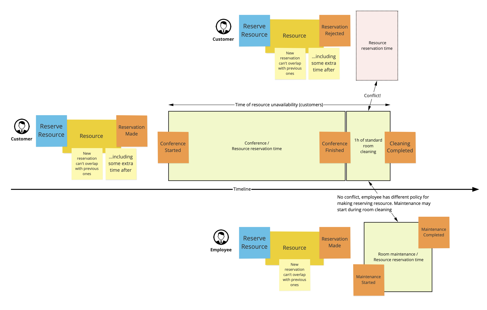

# Example: Availability / Resource

Description
------------

In many cases users need to rival for limited amount of resources. Good examples are:

- hot desks in co-working office
- copy of book in library
- rooms in hotel
- vehicles in car rental service
 
Depending on the context, resource may have one or more instances to reserve. This example describes single identifiable resource concept, where some extra policies may be injected in runtime.

Explanation
-----------

Resource can't be reserved for many reasons, e.g. car was damaged and need to be repaired, hotel room is occupied by someone or hotel staff is cleaning conference room after the event. From the reservation process perspective the only important thing is: it's not available at given moment. Finally, availability of the resource may be derived from other resource reservations.

Sometimes reservation will be connected with additional details, like costs, payer details or compensation for cancellation. But all these data are not needed to process reservation requests and should be stored outside resource aggregate.

Possible use-case scenarios
---------------------------

### Booking conference room

