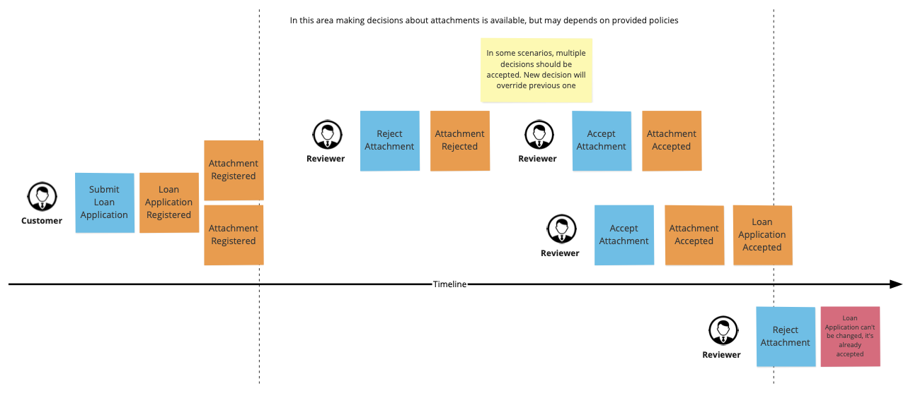

# Example: Loan / Loan Application

Description
------------

Let's assume we have a loan application process, where customer need to deliver some documents about income, credit cards and so on. Evaluation of the application depends on evaluation of these documents, e.g. in some cases all of them need to be verified positively to accept the application. Moreover, maybe there is a specific deadline for all documents checks.

Use-case scenario
-----------------

### Submitting and reviewing application attachments

